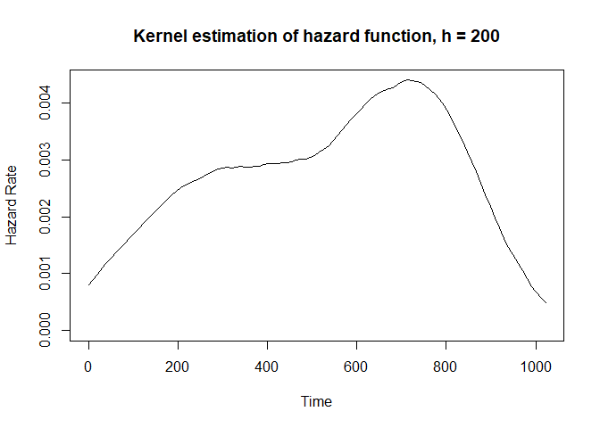
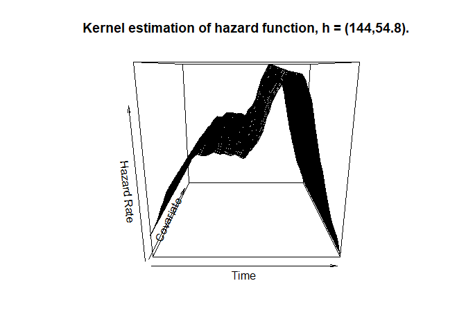
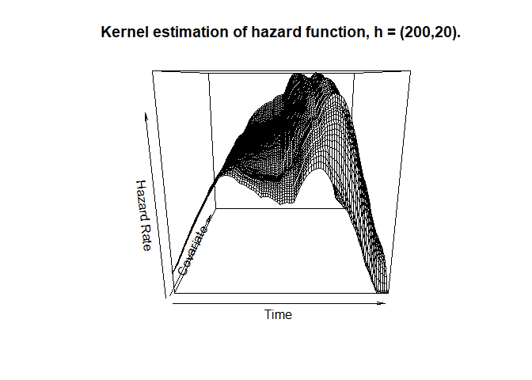

<!-- README.md is generated from README.Rmd. Please edit that file -->
kernhaz
=======

The goal of kernhaz is to estimate the unconditional and the conditional hazard function for right-censored data. The package includes two methods of the bandwidth selection - crossvalidation and maximum likelihood method.

Installation
------------

You can install the released version of kernhaz from [CRAN](https://CRAN.R-project.org) with:

``` r
install.packages("kernhaz")
```

Example
-------

The unconditional hazard function, the bandwidth is selected using the crossvalidation method:

``` r
library(survival)
fit1<-khazard(times = lung$time,delta = lung$status-1)
plot(fit1)
```


The unconditional hazard function, four bandwidths are considered:

``` r
library(survival)
fit2<-khazard(times = lung$time,delta = lung$status-1,h=c(100,150,200,250), value="both")
plot(fit2,h=200)
```



The conditional hazard function, bandwidths are selected using the crossvalidation method:

``` r
library(survival)
fit3<-khazardcond(times = lung$time,delta = lung$status-1,covariate = lung$age)
plot(fit3)
```



The conditional hazard function, bandwidths are user's choice:

``` r
library(survival)
fit4<-khazardcond(times = lung$time,delta = lung$status-1,covariate = lung$age,h=c(200,20))
plot(fit4)
```


